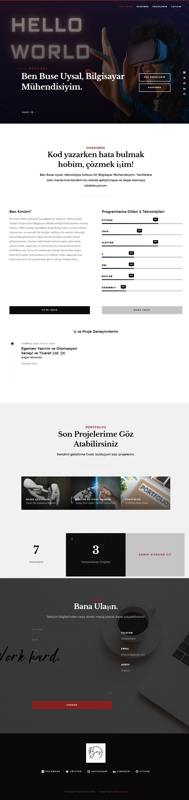
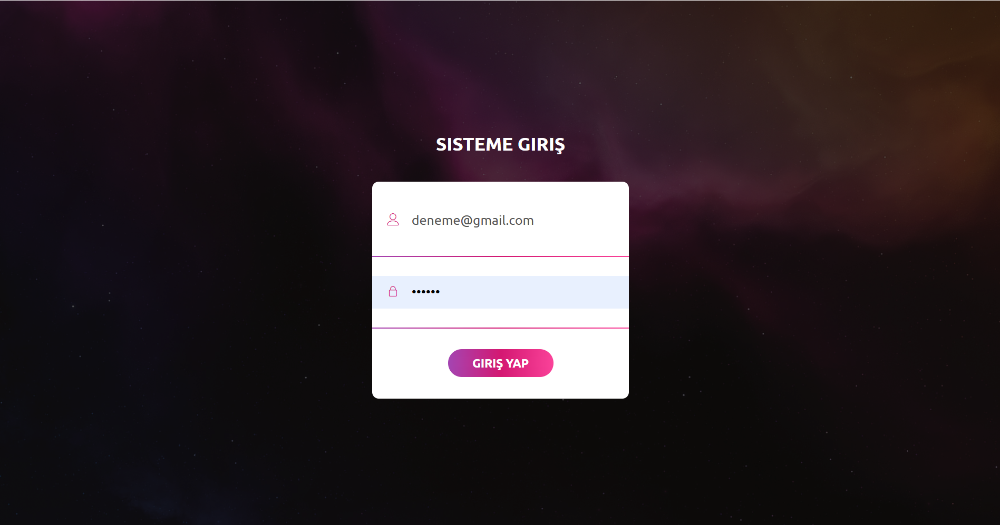
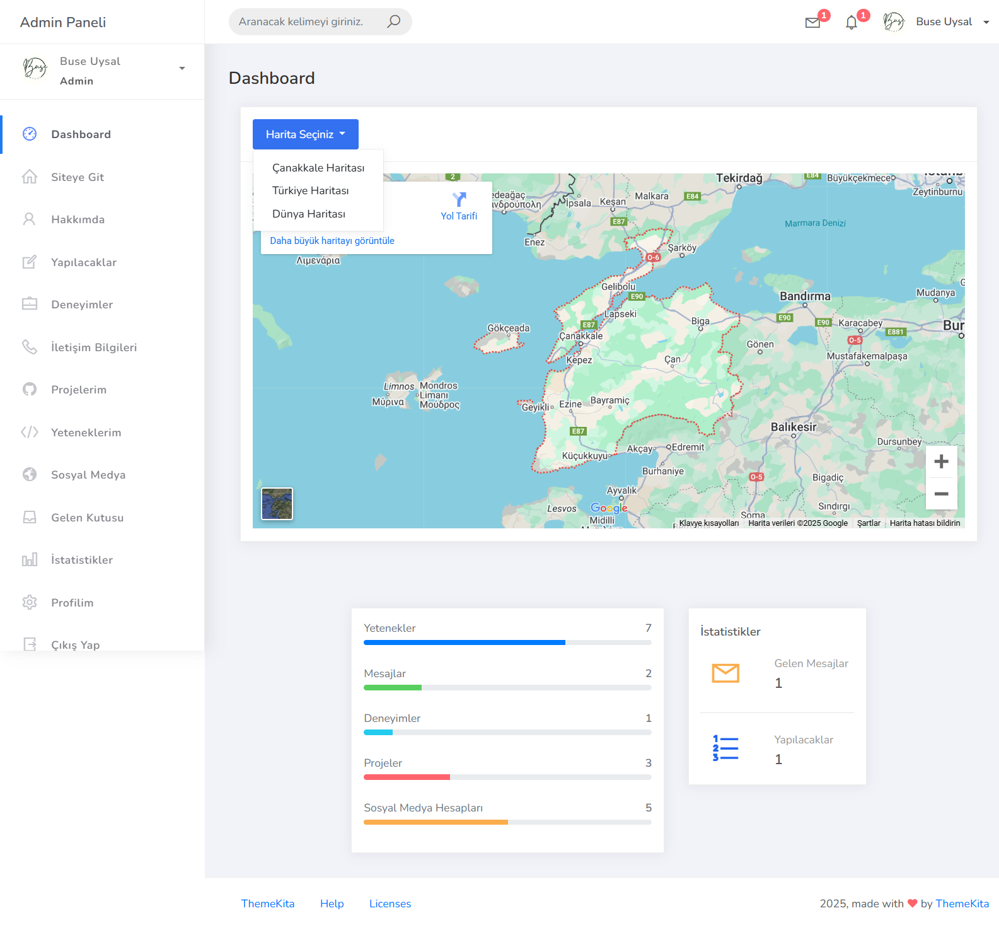
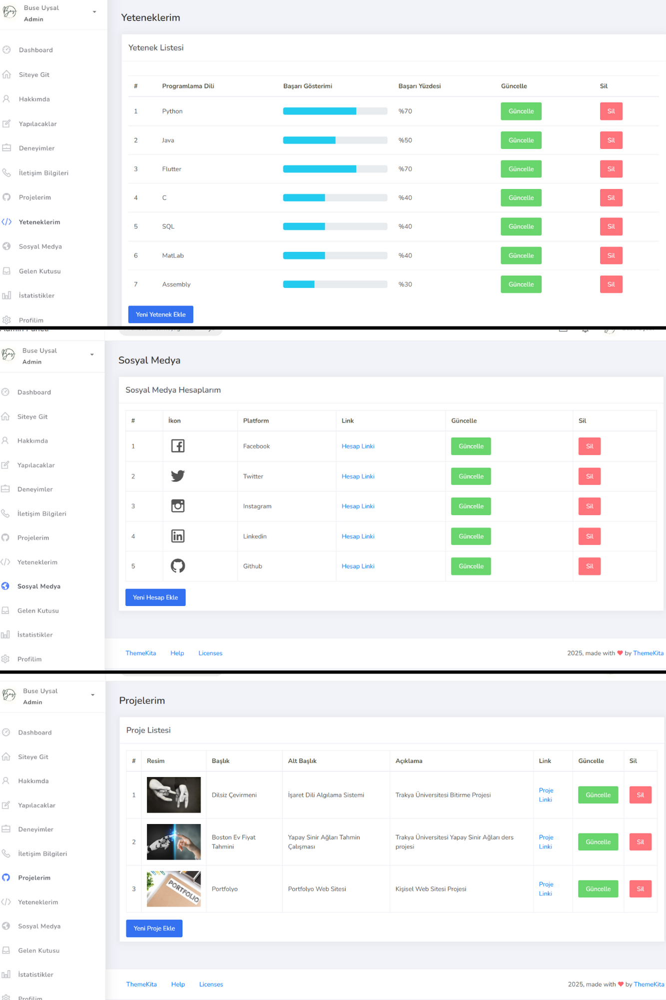
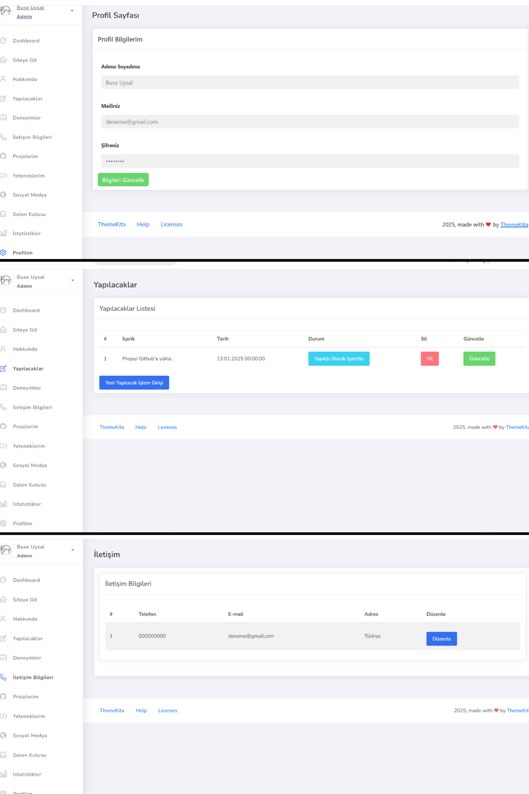
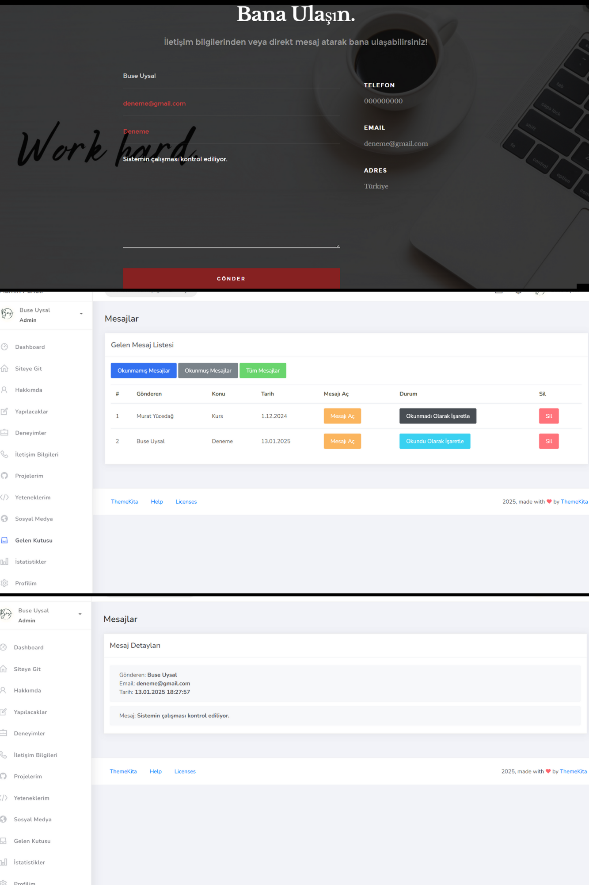
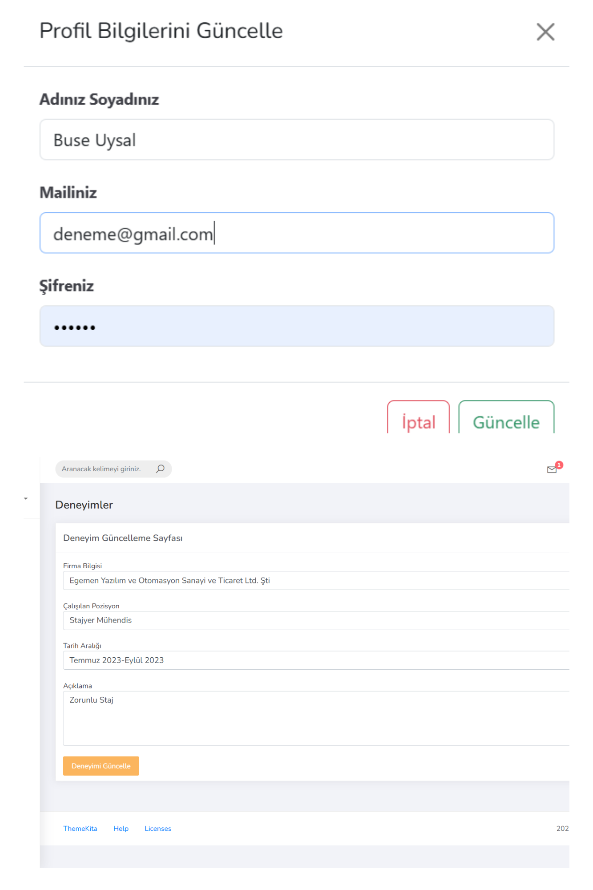
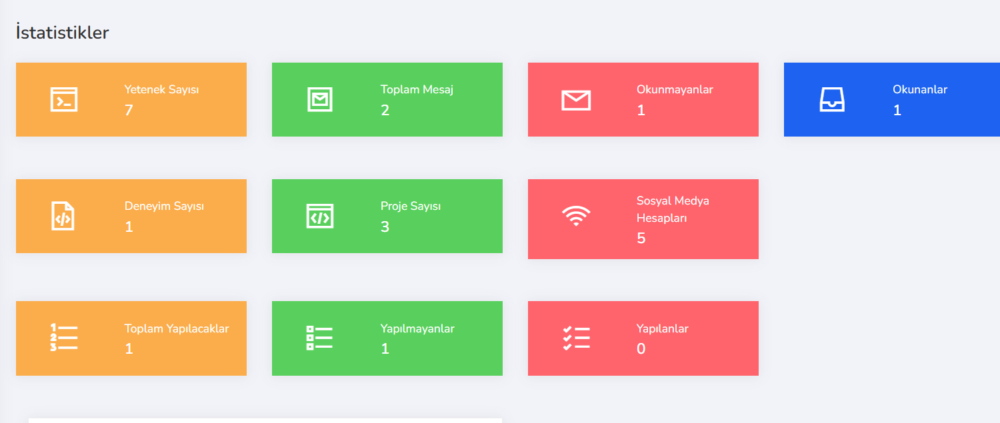
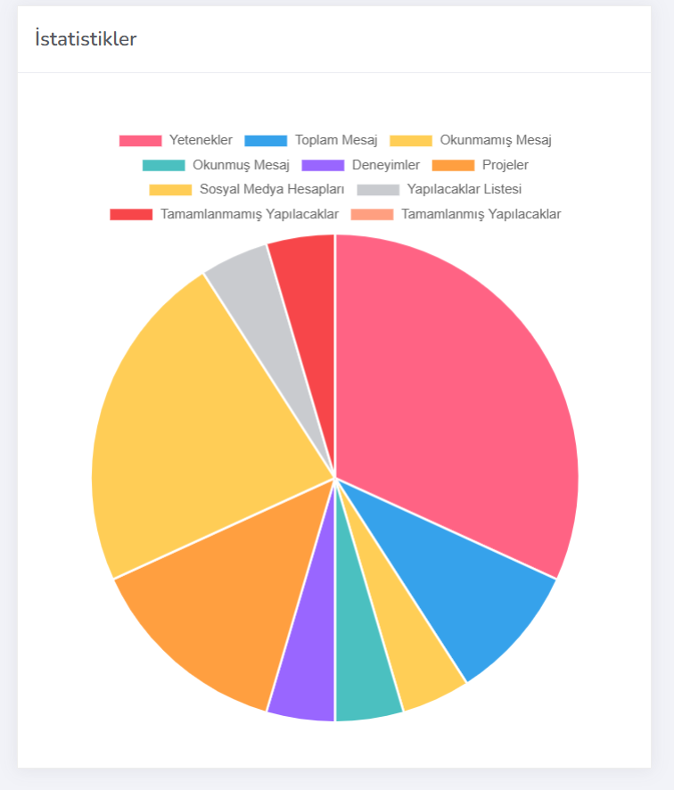

# MyPortfolio

Bu proje, Murat Yücedağ'ın Udemy'de bulunan "Asp.Net Core ile Admin Panelli Dinamik Bir Portfolyo Geliştirelim Part 1-2" kursunda yapmış olduğum bir portfölyo uygulamasıdır. Proje, hem kullanıcı dostu bir arayüz hem de güçlü bir admin paneli sunar.

## 🚀 Proje Özellikleri  

### **Kullanıcı Arayüzü**  
Admin paneli sayesinde dinamik bir şekilde güncellenebilir bilgiler ile kullanıcı dostu bir arayüz tasarlanmıştır.
- Sosyal Medya hesaplarına doğrudan erişim.
- Yeteneklerin yüzdesel gösterimi
- İndirilebilir CV
- Deneyim çizelgesi
- Proje kısa bilgileri ve link ile github koduna erişim
- Dinamik bilgiler ve admin paneline geçiş
- Doğrudan gelen kutusuna gönderilebilir iletişim kısmı

### **Admin Paneli**  
Admin paneli, portföyünüzü yönetmek için kapsamlı bir kontrol sağlar. Panelde **CRUD (Create, Read, Update, Delete)** işlemleri yapılabilir.
- **Giriş Sayfası:** Sisteme mail ve şifre ile girmeyi sağlar.
- **Dashboard:** Harita seçimi yaparak görüntüleme sağlar.
- **Siteye Git:** Kullanıcı arayüzüne geçiş yapar.
- **Hakkımda:** Kişisel bilgilerinizi ekleyebilir veya düzenleyebilirsiniz.  
- **Yapılacaklar:** Günlük görevlerinizi takip edebilir, düzenleyebilirsiniz.
- **Deneyimler:** İş deneyimlerinizi ekleyebilir, düzenleyebilirsiniz.  
- **İletişim Bilgileri:** Telefon, e-posta ve adres bilgilerinizi düzenleyebilirsiniz.  
- **Projeler:** Projelerinizi ekleyebilir, düzenleyebilirsiniz. (Fotoğraf, link, açıklama vb.)  
- **Yetenekler:** Bildiğiniz programlama dillerini ekleyebilir, düzenleyebilirsiniz. (Yüzdelik gösterim mevcuttur.)  
- **Sosyal Medya:** Sosyal medya hesaplarınızı ekleyebilir, düzenleyebilirsiniz. (İkon eklemesi yapılabilmesi için liste mevcuttur.)  
- **Gelen Kutusu:** Kullanıcılar tarafından gönderilen mesajları görebilir ve okunma durumuna göre filtreleyebilirsiniz.  
- **İstatistikler:** Mevcut istatistikleri dinamik olarak takip edebilirsiniz.  
- **Profilim:** Profil ayarlarını yönetebilirsiniz.
- **Çıkış Yap:** Sistemden çıkış yapıp kullanıcı arayüzüne geçebilirsiniz. (Çıkış yapma işlemi teğit edilmektedir.)

## 🛠️ Kullanılan Teknolojiler  

- **ASP.NET Core 6:** Projenin temel çatısını oluşturur.  
- **Entity Framework (Code-First Yaklaşımı):** Veritabanı işlemleri için kullanılmıştır.  
- **MSSQL:** Veritabanı yönetimi için tercih edilmiştir.  
- **View Components:** Projede dinamik içerik oluşturmak için kullanılmıştır.  
- **HTML, CSS, ThemaKita, Bootstrap:** Kullanıcı arayüzü için modern ve duyarlı tasarım.  
- **JavaScript:** Arayüzdeki dinamik etkileşimler için kullanılmıştır.  

## 📸 Ekran Görüntüleri  

### Kullanıcı Arayüzü  

### Admin Paneli  

